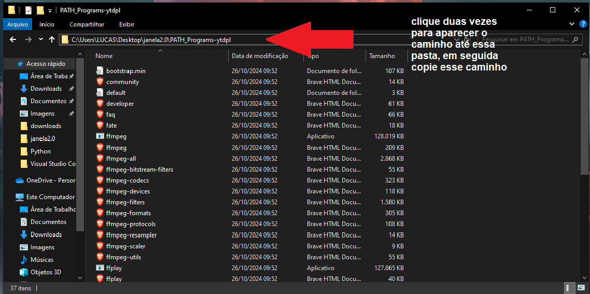

# YT MP3/MP4 DOWNLOAD
 Para a utilização do Software, você terá que instalar algumas dependencias em seu computador,
 essas dependências são o ffmpeg e ffprobe, eu deixarei uma pasta dentro do software escrita PATH_Programs-ytdpl que
 é onde você encontra o instalador do programa, no entando a instalação do ffmpeg e ffprobe não é de maneira convencional,então
 deixarei um passo a passo em imagens logo abaixo 👇
**OBSERVAÇÃO: Para o aplicativo funcionar o seu disco local precisa ser representado pela letra C: e você precisa instalar as dependências, além disso**
**o local onde vai se encontrar os downloads dos video em mp4 vai ser em C:\Users\Public\Downloads e os MP3 vão ser baixados no local onde o programa está sendo executado**

[👉CLIQUE AQUI PARA BAIXAR O SOFTWARE](https://www.mediafire.com/file/td4h5jzc24ky0zz/MP4-MP3+DOWNLOAD.rar/file)

## 1.Extraia a pasta do software na area de trabalho   

## 2.Encontre uma pasta escrita PATH_Programs-ytdpl e identifique o trajeto utilizado para chegar até essa pasta

## 3.Agora vá na barra de pesquisa do Windows e pesquise path

## 4.Entre na Variável de ambiente e editaremos a variavel de ambiente Path

## 5.Para verificar se o ffmpeg e o ffprobe funcionou você abri o Prompt de Comando como Administrador

# Bibliotecas usadas -->
- [x] tkinter
- [x] pytube
- [x] ytdpl